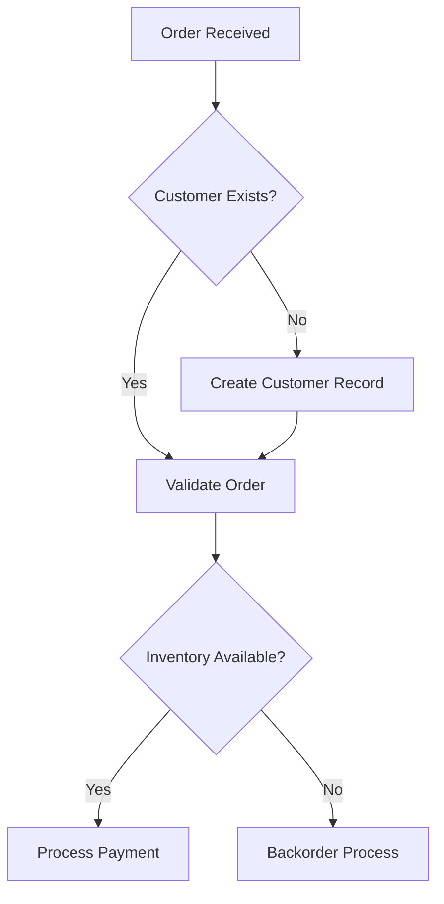

# SOP-to-Agentic-Automation Platform
## Kevin AI - Enterprise-Grade Process Transformation Engine

**Version:** 2.0  
**Date:** January 6, 2026  
**Client:** Cars Commerce  
**Demo Date:** January 8, 2026  
**Go-Live:** January 16, 2026

---

## 🎯 EXECUTIVE SUMMARY

Kevin AI is an enterprise-grade agentic platform that transforms Standard Operating Procedures (SOPs) into intelligent, executable workflows with comprehensive automation opportunities, test scenarios, and production-ready code.

### Key Capabilities

1. **SOP Ingestion** - Accepts Word, PDF, Mermaid diagrams, process flow images
2. **Current State Analysis** - AI-powered extraction and visualization of as-is processes
3. **Future State Generation** - Optimized digital twin with automation recommendations
4. **Automation Identification** - RPA, agentic AI, and integration opportunities
5. **Test Case Generation** - Comprehensive test scenarios at each process stage
6. **Code Generation** - Production-ready agentic workflow code
7. **KPI/SLA Analysis** - Efficiency improvements and ROI calculations

---

## 🏗️ SYSTEM ARCHITECTURE

### High-Level Architecture

```
┌─────────────────────────────────────────────────────────────────────┐
│                        INPUT LAYER                                  │
├─────────────────────────────────────────────────────────────────────┤
│  • SOP Documents (DOCX, PDF)                                        │
│  • Process Flow Diagrams (PNG, JPG, Mermaid)                        │
│  • Domain Context (Insurance, Logistics, Finance, Healthcare)       │
└─────────────────────────────────────────────────────────────────────┘
                               ↓
┌─────────────────────────────────────────────────────────────────────┐
│                    DOCUMENT PROCESSING LAYER                        │
├─────────────────────────────────────────────────────────────────────┤
│  • OCR Engine (PyMuPDF + Tesseract)                                │
│  • Text Extraction                                                   │
│  • Diagram Understanding (Vision LLM)                                │
│  • Structure Identification                                          │
└─────────────────────────────────────────────────────────────────────┘
                               ↓
┌─────────────────────────────────────────────────────────────────────┐
│                    AGENTIC AI LAYER (LangGraph)                     │
├─────────────────────────────────────────────────────────────────────┤
│                                                                      │
│  ┌─────────────────────┐   ┌─────────────────────┐                │
│  │  Master Orchestrator│   │  Context Manager     │                │
│  │  Agent              │──→│  Agent               │                │
│  └─────────────────────┘   └─────────────────────┘                │
│           ↓                          ↓                               │
│  ┌─────────────────────┐   ┌─────────────────────┐                │
│  │  SOP Analysis       │   │  Gap Identification  │                │
│  │  Agent              │   │  Agent               │                │
│  └─────────────────────┘   └─────────────────────┘                │
│           ↓                          ↓                               │
│  ┌─────────────────────┐   ┌─────────────────────┐                │
│  │  Process Mapping    │   │  Automation          │                │
│  │  Agent              │   │  Opportunity Agent   │                │
│  └─────────────────────┘   └─────────────────────┘                │
│           ↓                          ↓                               │
│  ┌─────────────────────┐   ┌─────────────────────┐                │
│  │  Future State       │   │  Test Case Generator │                │
│  │  Design Agent       │   │  Agent               │                │
│  └─────────────────────┘   └─────────────────────┘                │
│           ↓                          ↓                               │
│  ┌─────────────────────┐   ┌─────────────────────┐                │
│  │  Code Generator     │   │  KPI/SLA Calculator  │                │
│  │  Agent              │   │  Agent               │                │
│  └─────────────────────┘   └─────────────────────┘                │
│                                                                      │
└─────────────────────────────────────────────────────────────────────┘
                               ↓
┌─────────────────────────────────────────────────────────────────────┐
│                        OUTPUT LAYER                                 │
├─────────────────────────────────────────────────────────────────────┤
│  1. Current State Process Map (Mermaid + Visual)                    │
│  2. Gap Analysis Report                                              │
│  3. Future State Process Map (Optimized)                            │
│  4. Automation Opportunities List                                    │
│  5. Requirements Document (Functional + Non-Functional)              │
│  6. Test Case Scenarios (Unit, Integration, E2E)                    │
│  7. Production-Ready Code (Python/FastAPI)                           │
│  8. KPI/SLA Improvement Report                                       │
│  9. Implementation Roadmap                                           │
└─────────────────────────────────────────────────────────────────────┘
```

---

## 🤖 AGENTIC SYSTEM DESIGN

### Agent Roles & Responsibilities

#### 1. Master Orchestrator Agent
**Model:** Claude Sonnet 4.5 or GPT-4o  
**Responsibility:** Workflow coordination, agent delegation, decision-making
**Key Functions:**
- Route tasks to specialized agents
- Maintain state across agent interactions
- Resolve conflicts between agent outputs
- Quality assurance of final deliverables

#### 2. SOP Analysis Agent
**Model:** Claude Sonnet 4.5  
**Responsibility:** Deep SOP understanding and structure extraction
**Key Functions:**
- Extract processes, steps, decision points
- Identify actors/roles
- Map dependencies and sequences
- Detect manual vs. automated steps

#### 3. Process Mapping Agent
**Model:** GPT-4o  
**Responsibility:** Visual process representation
**Key Functions:**
- Generate Mermaid flowcharts
- Create current-state process maps
- Identify swim lanes and handoffs
- Detect bottlenecks visually

#### 4. Gap Identification Agent
**Model:** Claude Sonnet 4.5  
**Responsibility:** Compare SOP vs. diagram, identify inconsistencies
**Key Functions:**
- Cross-reference document and diagram
- Identify missing steps
- Flag ambiguities
- Recommend clarifications

#### 5. Automation Opportunity Agent
**Model:** GPT-4o  
**Responsibility:** Identify automation potential
**Key Functions:**
- Classify tasks (RPA, API, Agentic AI, Human)
- Calculate automation ROI
- Recommend tools/technologies
- Prioritize opportunities

#### 6. Future State Design Agent
**Model:** Claude Sonnet 4.5  
**Responsibility:** Optimized process design
**Key Functions:**
- Remove redundancies
- Propose parallel processing
- Design exception handling
- Create digital twin architecture

#### 7. Test Case Generator Agent
**Model:** GPT-4o  
**Responsibility:** Comprehensive test scenario creation
**Key Functions:**
- Generate happy path scenarios
- Create edge cases
- Design integration tests
- Define acceptance criteria

#### 8. Code Generator Agent
**Model:** Claude Sonnet 4.5  
**Responsibility:** Production code generation
**Key Functions:**
- Generate FastAPI services
- Create agentic workflow code
- Implement error handling
- Add logging and monitoring

#### 9. KPI/SLA Calculator Agent
**Model:** GPT-4o  
**Responsibility:** Performance metrics analysis
**Key Functions:**
- Calculate cycle time improvements
- Estimate cost savings
- Define SLA targets
- Create ROI models

---

## 🔄 WORKFLOW EXECUTION

### Phase 1: Document Ingestion (30 seconds)

```
User uploads SOP → Document Processing → Text Extraction → 
Structure Identification → Store in Vector DB
```

**Outputs:**
- Extracted text
- Document structure (sections, tables, lists)
- Embedded vectors for semantic search

### Phase 2: Current State Analysis (2 minutes)

```
SOP Analysis Agent → Extract process steps → Process Mapping Agent → 
Generate current state diagram
```

**Outputs:**
- Current state process map (Mermaid)
- Process step inventory
- Role/actor identification
- Decision point catalog

### Phase 3: Gap Analysis (1 minute)
*(If both SOP and diagram are provided)*

```
Gap Identification Agent → Compare documents → Identify discrepancies → 
Generate gap report
```

**Outputs:**
- Gap analysis report
- Reconciliation recommendations

### Phase 4: Automation Analysis (2 minutes)

```
Automation Opportunity Agent → Classify steps → Calculate ROI → 
Prioritize opportunities
```

**Outputs:**
- Automation opportunity matrix
- Technology recommendations
- ROI calculations
- Implementation priorities

### Phase 5: Future State Design (3 minutes)

```
Future State Design Agent → Optimize process → Remove bottlenecks → 
Generate digital twin
```

**Outputs:**
- Future state process map (Mermaid)
- Digital twin architecture
- Integration points
- Exception handling design

### Phase 6: Test Case Generation (2 minutes)

```
Test Case Generator Agent → Analyze each step → Generate scenarios → 
Create coverage matrix
```

**Outputs:**
- Test case scenarios (Unit, Integration, E2E)
- Test data requirements
- Coverage matrix
- Acceptance criteria

### Phase 7: Code Generation (3 minutes)

```
Code Generator Agent → Design services → Generate FastAPI code → 
Add instrumentation
```

**Outputs:**
- Production-ready Python code
- API specifications (OpenAPI)
- Deployment configurations
- Monitoring setup

### Phase 8: KPI/SLA Analysis (1 minute)

```
KPI/SLA Calculator Agent → Calculate improvements → Generate ROI → 
Create dashboard
```

**Outputs:**
- KPI improvement report
- SLA targets
- ROI model
- Performance dashboard

**Total Execution Time:** ~14 minutes for complete analysis

---

## 📊 OUTPUT ARTIFACTS

### 1. Current State Process Map

**Format:** Mermaid flowchart + PNG export  
**Contents:**
- All process steps
- Decision points
- Actors/systems involved
- Manual vs. automated indicators
- Bottleneck highlighting

**Example:**


### 2. Gap Analysis Report

**Format:** Markdown + DOCX  
**Contents:**
- Inconsistencies between SOP and diagram
- Missing steps
- Ambiguous descriptions
- Recommendations

### 3. Future State Process Map

**Format:** Mermaid flowchart + PNG export  
**Contents:**
- Optimized process flow
- Automation integration points
- Parallel processing opportunities
- Exception handling
- Integration APIs

### 4. Requirements Document

**Format:** DOCX + Markdown  
**Sections:**
- Functional requirements
- Non-functional requirements (performance, security, scalability)
- Integration requirements
- Data requirements
- Compliance requirements

### 5. Automation Opportunities List

**Format:** Excel + Markdown  
**Columns:**
- Step ID
- Step Description
- Automation Type (RPA/API/Agentic)
- Complexity (Low/Medium/High)
- ROI Score
- Priority
- Recommended Tools
- Implementation Timeline

### 6. Test Case Scenarios

**Format:** Excel + Markdown  
**Test Types:**
- Unit Tests (per component)
- Integration Tests (between systems)
- End-to-End Tests (full workflow)
- Performance Tests
- Security Tests

**Per Test Case:**
- Test ID
- Test Name
- Preconditions
- Test Steps
- Expected Results
- Test Data
- Priority
- Coverage Area

### 7. Production-Ready Code

**Format:** Python files (FastAPI)  
**Structure:**
```
/code
  /agents          # LangGraph agent definitions
  /api             # FastAPI endpoints
  /models          # Pydantic models
  /services        # Business logic
  /integrations    # External system connectors
  /utils           # Helper functions
  /tests           # Unit and integration tests
  /config          # Configuration files
  docker-compose.yml
  requirements.txt
  README.md
```

### 8. KPI/SLA Improvement Report

**Format:** PowerPoint + Excel  
**Metrics:**
- Current vs. Future cycle time
- Cost per transaction
- Error rate reduction
- SLA compliance improvement
- Customer satisfaction impact
- ROI calculations

---

## 🛠️ TECHNOLOGY STACK

### AI/ML Layer
- **LLM Provider:** Azure OpenAI (GPT-4o, GPT-4o-mini) or Anthropic (Claude Sonnet 4.5)
- **Agentic Framework:** LangGraph + LangChain
- **Vector Database:** FAISS (local) or Azure AI Search (production)
- **Embedding Model:** text-embedding-3-large or text-embedding-ada-002

### Application Layer
- **Backend:** FastAPI (Python 3.12)
- **Frontend:** Gradio (MVP) or React (Production)
- **API Gateway:** Azure API Management
- **Authentication:** Azure AD / OAuth 2.0

### Data Layer
- **Document Storage:** Azure Blob Storage
- **Metadata DB:** PostgreSQL or Azure SQL
- **Cache:** Redis

### DevOps/Infrastructure
- **Containerization:** Docker + Docker Compose
- **Orchestration:** Kubernetes (AKS)
- **CI/CD:** GitHub Actions or Azure DevOps
- **Monitoring:** Azure Application Insights + OpenTelemetry
- **Logging:** ELK Stack or Azure Monitor

### Multi-Cloud Support
- **Azure:** Primary (for MVP and Mendix integration)
- **AWS:** S3, Lambda, Bedrock (alternative)
- **GCP:** Cloud Storage, Cloud Run, Vertex AI (alternative)

---

## 🚀 MVP DEPLOYMENT STRATEGY

### Local Development
```bash
# Clone repository
git clone https://github.com/xyz-consulting/kevin-sop-automation
cd kevin-sop-automation

# Set up environment
python -m venv venv
source venv/bin/activate  # Windows: venv\Scripts\activate
pip install -r requirements.txt

# Configure environment variables
cp .env.example .env
# Edit .env with API keys

# Run locally
python main.py
```

### Azure Deployment

**Architecture:**
```
Azure Front Door → Azure App Service (Kevin API) → 
Azure OpenAI → Azure Blob Storage → Azure SQL Database
```

**Deployment Steps:**
1. Create Azure resources via Terraform/Bicep
2. Build Docker container
3. Push to Azure Container Registry
4. Deploy to Azure App Service or AKS
5. Configure Application Insights
6. Set up managed identity for secure access

**Infrastructure as Code:**
```bash
# Deploy using Terraform
cd infrastructure/terraform
terraform init
terraform plan -out=tfplan
terraform apply tfplan

# Or using Azure CLI
./deploy.sh --environment production --region eastus
```

---

## 🎯 DEMO PLAN (January 8, 2026)

### Scenario: Cars Commerce EDI Order Processing

**Input:**
- SOP document (Cars Commerce EDI process)
- Mermaid process diagram (provided in initial request)

**Demo Flow (15 minutes):**

1. **Upload SOP** (1 min)
   - Show document upload interface
   - Display document parsing progress

2. **Current State Analysis** (2 min)
   - Show extracted process map
   - Highlight key steps and decision points
   - Display actor/system identification

3. **Gap Analysis** (1 min)
   - Present inconsistencies between SOP and diagram
   - Show recommendations

4. **Automation Opportunities** (3 min)
   - Display automation matrix
   - Show ROI calculations
   - Present prioritization

5. **Future State Design** (2 min)
   - Show optimized process map
   - Highlight improvements
   - Display digital twin architecture

6. **Test Case Scenarios** (2 min)
   - Show test case catalog
   - Demonstrate coverage matrix
   - Present acceptance criteria

7. **Generated Code** (2 min)
   - Show FastAPI code structure
   - Display agentic workflow code
   - Demo API playground

8. **KPI/SLA Report** (2 min)
   - Present improvement metrics
   - Show ROI model
   - Display performance dashboard

---

## 📈 SUCCESS METRICS

### For MVP Demo
- ✅ Complete analysis in < 15 minutes
- ✅ 90%+ accuracy in process extraction
- ✅ Identify at least 5 automation opportunities
- ✅ Generate 50+ test cases
- ✅ Produce deployable code
- ✅ Calculate measurable ROI

### For Production (Post Go-Live)
- ✅ Process 10+ SOPs per day
- ✅ 95%+ accuracy in automation identification
- ✅ 30% reduction in process analysis time
- ✅ 50% increase in test coverage
- ✅ 99.9% API uptime
- ✅ < 2 second API response time

---

## 🔐 SECURITY & COMPLIANCE

### Data Security
- Encryption at rest (AES-256)
- Encryption in transit (TLS 1.3)
- Secure API key management (Azure Key Vault)
- PII detection and masking

### Compliance
- GDPR compliant
- SOC 2 Type II ready
- HIPAA considerations (for healthcare SOPs)
- ISO 27001 alignment

### Access Control
- Role-based access control (RBAC)
- Multi-factor authentication (MFA)
- Audit logging
- Data retention policies

---

## 📝 NEXT STEPS

### Pre-Demo (Before Jan 8)
1. ✅ Complete MVP development
2. ✅ Load sample Cars Commerce SOP
3. ✅ Prepare demo script
4. ✅ Set up demo environment
5. ✅ Create presentation deck

### Pre-Production (Jan 8-16)
1. Security review with CSO
2. Mendix integration testing
3. Load testing
4. User acceptance testing (UAT)
5. Documentation completion
6. Training materials

### Go-Live (Jan 16)
1. Production deployment
2. Monitoring setup
3. Support team readiness
4. Client handover
5. Post-deployment review

---

**Document Owner:** Sathya (Principal Architect, XYZ Consulting)  
**Last Updated:** January 6, 2026  
**Status:** Ready for MVP Demo

